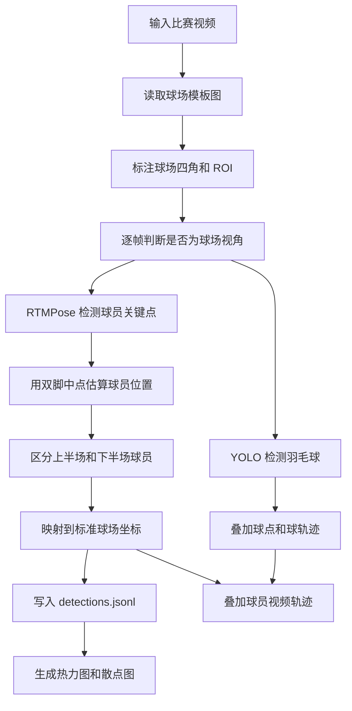

# 球员移动位置可视化功能说明

## 结论

当前项目更适合先收敛成一个通用的“羽毛球比赛球员移动与羽毛球轨迹可视化”工具。

主流程保留：

1. 读取比赛视频。
2. 标注或读取球场四角和 ROI。
3. 使用 RTMPose 检测球员关键点。
4. 用双脚中点估算球员落点。
5. 把画面坐标映射到标准羽毛球场坐标。
6. 使用 YOLO 检测羽毛球，并叠加球点和球轨迹。
7. 输出带轨迹叠加的视频、逐帧 JSONL 检测记录、整场/回合级热力图和散点图。

暂缓默认启用：

- 击球点检测。
- 技术动作统计。
- `templates/Statistical templates.xlsx`。
- `templates/Technical-name-map.xlsx`。

原因很简单：击球点和技术动作统计依赖更多规则假设，当前稳定性不够。它们一旦默认启用，会直接影响用户对整体效果的判断。羽毛球检测权重可以公开，所以羽毛球检测和轨迹可视化可以保留在开源主线里。

## MVP 范围

保留：

- 视频读取和输出。
- 球场模板图选择。
- 球场四角和 ROI 标注。
- RTMPose 人体关键点检测。
- 上半场/下半场球员区分。
- 球员脚底中心点估算。
- 图像坐标到球场坐标的透视变换。
- `metadata.json` 元数据输出。
- `detections.jsonl` 逐帧检测输出。
- 视频画面中的球员点位、骨架、移动轨迹。
- 右上角小球场轨迹叠加。
- 羽毛球检测和轨迹显示。
- 赛后位置热力图、散点图。
- 基础移动统计：移动距离、当前速度、最大速度。

默认关闭：

- 击球点识别。
- 击球截图/GIF。
- 技术动作分类。
- 技术动作 Excel 统计表。
- 依赖 `Technical-name-map.xlsx` 的动作名称映射。

这些能力可以后续作为实验分支或高级功能，不建议放在第一版通用流程里。

## 推荐流程



## 输出结构

```text
results/<video_name>/
├── metadata.json
├── detections.jsonl
├── detect_<video_name>.mp4
├── court_annotations.txt
└── position_visualizations/
    ├── heatmaps/
    │   ├── match_heatmap.png
    │   └── rally_<id>_heatmap.png
    └── scatter_plots/
        ├── match_scatter.png
        └── rally_<id>_scatter.png
```

## JSONL 记录格式

`detections.jsonl` 每一行是一帧的检测记录。选择 JSONL 的原因是视频逐帧数据天然是流式数据，长视频不需要一次性把整个 JSON 数组加载进内存，后续也方便增量写入和按行恢复。

示例：

```json
{"schema_version":"1.0","frame":123,"time_sec":4.1,"detect_frame":98,"players":{"upper":{"image":[512.0,342.0],"court":[3.1,4.2],"speed":1.4,"hands":{"left":[500.0,300.0],"right":[530.0,305.0]}},"lower":{"image":[520.0,820.0],"court":[3.0,10.8],"speed":1.8,"hands":{"left":null,"right":[540.0,780.0]}}},"shuttlecock":{"image":[610.0,420.0]}}
```

字段说明：

- `schema_version`：检测记录 schema 版本。
- `frame`：原视频帧号。
- `time_sec`：该帧对应的视频时间。
- `detect_frame`：球场视角有效检测帧计数。
- `players.upper` / `players.lower`：上半场和下半场球员。
- `image`：图像坐标 `[x, y]`。
- `court`：标准球场坐标 `[x, y]`，单位米。
- `speed`：当前估算速度，单位 m/s。
- `hands.left` / `hands.right`：手部图像坐标。
- `shuttlecock.image`：羽毛球图像坐标。

`metadata.json` 保存视频、模型、球场标注和输出文件信息，适合给后续工具判断数据来源和 schema。

## 推荐命令

最小可视化流程：

```bash
python main.py ^
  --video-path videos/00001.mp4 ^
  --template-path templates/00001.png ^
  --output-dir results/00001_position ^
  --no-display ^
  --no-audio
```

如果只想要赛后热力图和散点图，可以进一步减少视频叠加层：

```bash
python main.py ^
  --video-path videos/00001.mp4 ^
  --template-path templates/00001.png ^
  --output-dir results/00001_position ^
  --no-display ^
  --no-audio ^
  --no-skeletons ^
  --no-player-trajectories ^
  --no-court-trajectory ^
  --no-player-stats
```

## 后续高级功能

击球点检测建议等算法更稳定后再迁移到 `detections.jsonl`。届时可以用显式参数开启：

```bash
--analyze-hit-points
```

这部分应该独立于主线位置可视化，Excel 模板也应该作为实验/项目定制资产，不放进通用默认流程。

## 成功标准

- 新用户只准备视频、球场模板图、RTMPose 模型和可公开的羽毛球 YOLO 权重，就能跑通默认可视化流程。
- 羽毛球检测只影响球点/球轨迹显示，不影响球员位置热力图和散点图。
- 默认不会生成击球点、技术动作、Excel 统计。
- 输出数据格式稳定，热力图和散点图可以从 `detections.jsonl` 重复生成。
- 失败时错误信息指向具体缺失项，例如模板图、视频路径、RTMPose 模型，而不是击球点或 Excel 模板。
